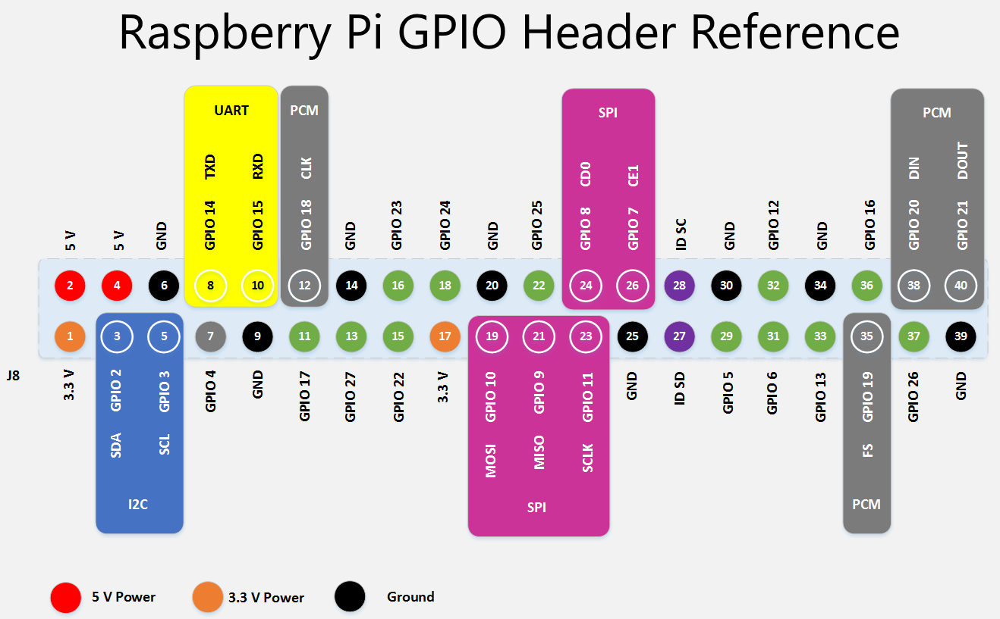
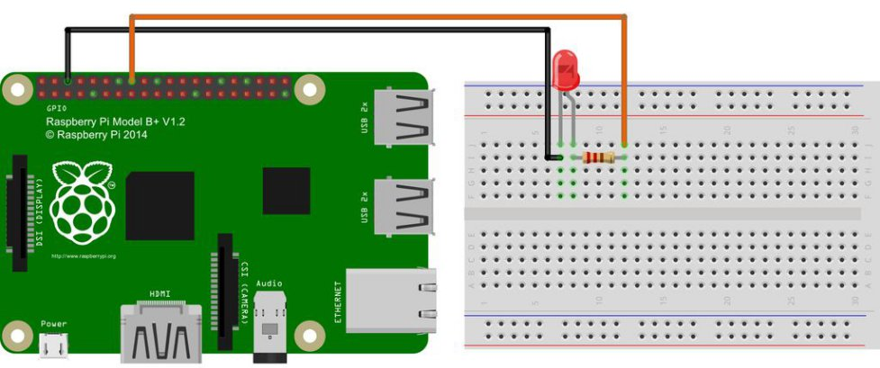

[](https://www.npmjs.com/package/gpio-controller)
[](https://www.npmjs.com/package/gpio-controller)

# gpio-controller
Node.JS Библиотека предоставляющая доступ работы с GPIO для платформ Raspberry Pi или BeagleBone, а так же разработку и тестирование на компьютерах без GPIO при помощи эмуляции работы библиотеки [onoff](https://www.npmjs.com/package/onoff)

**gpio-controller** является надстройкой над библиотекой [onoff](https://www.npmjs.com/package/onoff) расширяющей её функционал:

- объединение пинов в группы
- создание обработчиков событий для групп
- групповое изменение направления ввода/вывода, фронтов прерывания, инверсии GPIO
- эмуляция работы библиотеки для тестирования(mock) функций на компьютерах без GPIO

Цель написания данной библиотеки состояла в том, чтоб немного облегчить разрабтку предоставив функционал для работы с группой пинов. Если Вы обнаружили ошибку, или возникли вопросы - [пишите](https://github.com/valderanvvk/gpio-controller/issues), буду стараться как можно быстрее ответить или исправить ошибку. 
Хорошего настроения и замечательного дня!

ОС: Linux
Node.js versions 12+
**English version of documentation coming soon**

## Содержание
* [Немного о том как все работает](#немного-о-том-как-все-работает)
	* [Особенности работы с GPIO](#особенности-работы-с-gpio)
	* [Ввод и Вывод Direction](#ввод-и-вывод-direction)
	* [Библиотека onoff](#библиотека-onoff)
* [Установка](#установка)
* [Использование](#использование)
	* [Работа со светодиодами или подаем напряжение на пин](#работа-со-светодиодами-или-подаем-напряжение-на-пин)
	* [Работа с кнопками или опрос пинов](#работа-с-кнопками-или-опрос-пинов)
	* [Работа с группами пинов direction out](#работа-с-группами-пинов)
	* [Организация групп direction in](#организация-групп-direction-in)
* [GpioMock мокаем GPIO при тестировании](#gpiomock-мокаем-gpio-при-тестировании)
* [API](#api)

## Немного о том как все работает
:warning: Все приведенные примеры показаны на базе Raspberry Pi 3 Model B+
#### Особенности работы с GPIO
- Максимальный суммарный ток обоих выводов 3,3В равен 50 мА, напрямую можно подключать устройства только с током потребления меньше 50 мА.
- Максимальный суммарный ток обоих выводов 5В равен 300 мА.
- На выводы GPIO нельзя подавать напряжение выше 3,3В - можно спалить вход или весь процессор.
- Выводы 14 и 15 по умолчанию выполняют альтернативную функцию и являются выводами UART (RXD и TXD), поэтому при включении на них присутствует высокий уровень 3,3В
- Все настраиваемые выводы GPIO (кроме SDA и SCL) по умолчанию являются входами и поэтому имеют высокое сопротивление
- Расположение нумерации GPIO отличается от физической нумерации на сокете 


#### Ввод и Вывод Direction
- **"out" / "high" / "low"** - устанавливает GPIO на выход, если необходимо подать напряжение на пин, например, для светодиода или управления каким-либо устройством: 1 - пин включен и напряжение подается, 0 - пин выключен и напряжени не подается. **«high»** и **«low»** — это варианты **«out»**, которые настраивают GPIO как выход с начальным уровнем. 1 или 0 соответственно.
- **"in"** - устанавливает GPIO на вход c начальным уровнем 1

#### Библиотека onoff
За основу работы с GPIO была взята библиотка [onoff](https://www.npmjs.com/package/onoff).
GpioController дает возможность работать с отдельными пинами, как инстансом класса Gpio данной библиотеки.
Библиотека хорошо документирована, предлагаем Вам ознакомиться с документацией по её использованию.

##Установка

```
npm i gpio-controller
```

## Использование

**Typescript:**
``` Typescript
import { GpioController } from 'gpio-controller';

const mock = GpioController.GPIOACCESS ? false : true;
const gpio = new GpioController({ mock });
```

**Javascript:**
``` Javascript
const { GpioController } = require('gpio-controller');

const mock = GpioController.GPIOACCESS ? false : true;
const gpio = new GpioController({ mock });
```
- GpioController.GPIOACCESS - Определяет, возможен ли доступ к GPIO. Значение true, если текущий процесс имеет разрешения, необходимые для экспорта GPIO в пользовательское пространство. ложно в противном случае. Грубо говоря, если это свойство истинно, текущий процесс должен иметь возможность создавать объекты Gpio.

- mock - определяет необходимость использования библиотеки onoff или GpioMock. Если разработка ведется на платформе не имеющей GPIO, mock:true позволяет тестировать функционал эмулируя работы библиотеки onoff и настраивать необходимое поведение.

####Работа со светодиодами или подаем напряжение на пин
Подключим светодиод на GPIO 23 по схеме(вы можете использовать другую схему подключения или другие устройства, например мультиметр, для проверки подачи напряжения на пин):

Сделаем так, чтоб светодиод засветился
``` Typescript
import { GpioController } from 'gpio-controller';

const gpio = new GpioController();

const PIN = 14
gpio.setPIN({ gpio: PIN, direction: 'out' });
gpio.switchOn(PIN);
```
Метод switchOn - изменяет состояние пина подавая на него напряжение.
Обратный метод switchOff - заставит погаснуть горящий светодиод
``` Typescript
gpio.switchOff(PIN);
```
А теперь поморгаем несколько раз светодиодом c интервалом в секунду
``` Typescript
import { GpioController } from 'gpio-controller';

const gpio = new GpioController();

const PIN = 14
gpio.setPIN({ gpio: PIN, direction: 'out' });

let count = 0;
const interval = setInterval(() => {
	count++;
	gpio.toggle(PIN);
	if (count >= 4) {
		clearInterval(interval);
		gpio.deletePIN(PIN);
	}
}, 1000);
```
как видите - все достаточно легко. Просто используем метод toggle для изменения состояния пина.

#### Работа с кнопками или опрос пинов
Для опроса пинов, работ с кнопками или другими устройствами подающими напряжение на контроллируемый пин, необходимо установить направление(Direction) в 'in'. Сделаем пример, в котором установим кнопку на GPIO 4, на GPIO 24 установим светодиод и будем включать/выключать светодиод на нажатие кнопки
``` Typescript
import { GpioController } from 'gpio-controller';
import { ValueCallback } from 'gpio-controller/gpio/gpio.interface';

const gpio = new GpioController();

const LED = 24;
const BUTTON = 4;
gpio.setPIN({ gpio: LED, direction: 'out' });
gpio.setPIN({ gpio: BUTTON, direction: 'in', edge: 'falling' });

const callback: ValueCallback = (err, value) => {
	if (!err) {
		gpio.toggle(LED);
	}
};

gpio.watchPIN(callback, BUTTON);
```
при нажатии кнопки происходит вызов callback-функции в которой при помощи toggle меняется состояние пина со светодиодом. 

####Чтение/Изменение состояния пина
Для чтения и изменения состояния используются методы
``` Typescript
// Чтение состояния, возврат Promise 0 или 1
gpio.readSignal(pin: number): Promise<BinaryValue>;

// Изменение состояния, указываем номер пина и необходимое состояние 1 или 0
// Возврат true - состяние установлено / false - ошибка установки состояния
writeSignal(pinNumber: number, signal: BinaryValue): Promise<boolean>
```
Для примера реализуем функционал toggle из предидущего примера при помощи этих двух методов
``` Typescript
import { GpioController } from 'gpio-controller';
import { BinaryValue, ValueCallback } from 'gpio-controller/gpio/gpio.interface';

const gpio = new GpioController();

const LED = 24;
const BUTTON = 4;
gpio.setPIN({ gpio: LED, direction: 'out' });
gpio.setPIN({ gpio: BUTTON, direction: 'in', edge: 'falling' });

const callback: ValueCallback = async (err, value) => {
	if (!err) {
		const pinValue = await gpio.readSignal(LED) ^ 1;
		await gpio.writeSignal(LED, pinValue as BinaryValue);
	}
};

gpio.watchPIN(callback, BUTTON);
```
#### Работа с группами пинов
**Direction: out**
GpioController позволяет объединять пины в группы и работать с массивом пинов изменяя их состояние вызовом одного метода, автоматически инициализировать группу пинов, формировать несколько групп пинов, вешать слушателей на группы с direction 'in'.
Если необходимо одновременно менять состояние нескольких пинов, это можно сделать при помощи switchGroupOn
Допустим на пинах: 10, 12, 13, 14, 16, 19 - установлены светодиоды. Давайте создадим группу их этих пинов, и затем изменим состояние этих пинов
``` Typescript
import { GpioController } from 'gpio-controller';
import { GroupGpio } from 'gpio-controller/gpio/gpio.interface';

const gpio = new GpioController();

// Номера пинов для инициализации
const LEDS = [10, 12, 13, 14, 16, 19];

// ID группы
const groupName = 'ledgroup';

// объект описывающий группу
const ledGroup: GroupGpio = {
	groupid: groupName,
	direction: 'out',
	gpio: LEDS
}

// создадим группу
gpio.addGroup(ledGroup);
// изменим состояние всех пинов группы 
gpio.switchGroupOn(groupName);
```
Вот и все, инициализированно 6 пинов и изменено из состояние, диоды светятся :) 
точно так же просто можно и "поморгать" этими диодами 
``` Typescript
import { Blink, GpioController } from 'gpio-controller';
import { GroupGpio } from 'gpio-controller/gpio/gpio.interface';

const gpio = new GpioController();

// Номера пинов для инициализации
const LEDS = [10, 12, 13, 14, 16, 19];

// ID группы
const groupName = 'ledgroup';

// объект описывающий группу
const ledGroup: GroupGpio = {
	groupid: groupName,
	direction: 'out',
	gpio: LEDS
}

// создадим группу
gpio.addGroup(ledGroup);
// моргаем :)
const blink = new Blink(gpio);
blink.setGroup(groupName);
blink.start(1000, 10);
```

#### Организация групп direction in
При инициализации GPIO direction: in необходимо учитывать фронт прерывания.
edge - параметр, указывающий фронт или фронты генерации прерывания для входного GPIO. Допустимые значения: «none», «rising», «falling» или «both». Независимо от того, поддерживаются ли прерывания входным GPIO, зависит от GPIO. Если прерывания не поддерживаются, свойство edge и метод setGroupEdge использовать не следует.:warning:**Прерывания не поддерживаются выходными GPIO**:x:
Пример создания группы кнопок:
``` Typescript
const buttonGroup: GroupGpio = {
	groupid: 'buttons',
	direction: 'in',
	edge: 'both',
	gpio: [2, 3, 4],
}
```
Для примера создадим две группы: 
1. Группа с пинами для светодиодов [10, 12, 13, 14, 16, 19]
2. Группа кнопок из двух штук [4, 8]
3. Создадим 1 обработчик событий группы кнопок, при нажатии на кнопку 2 будем зажигать группу светодиодов, при нажатии на кнопку три - гасить светодиоды
``` Typescript
import { GpioController } from 'gpio-controller';
import { GroupGpio, PinValueCallback } from 'gpio-controller/gpio/gpio.interface';

const gpio = new GpioController();

const LEDS = [10, 12, 13, 14, 16, 19];
const BUTTONS = [4, 8];

const groupLeds = 'ledgroup';
const groupButtons = 'buttons';

const ledGroup: GroupGpio = {
	groupid: groupLeds,
	direction: 'out',
	gpio: LEDS
}

const buttoGroup: GroupGpio = {
	groupid: groupButtons,
	direction: 'in',
	edge: 'falling',
	gpio: BUTTONS,
}

const callback: PinValueCallback = (err, value, pin, group) => {
	if (pin == 4) gpio.switchGroupOn(groupLeds);
	if (pin == 8) gpio.switchGroupOff(groupLeds);
}

gpio.addGroup(ledGroup);
gpio.addGroup(buttoGroup)
gpio.watchGroup(groupButtons, callback);
```
функция callback типа PinValueCallback принимает 4 параметра:
- err - ошибка new Error / undefined
- value - (0 / 1) При edge: both нажатая кнопка(falling) возвращает 0, отжатая(rising) кнопка 1  
- pin? - номер пина от которого была вызвана функция
- group? - группа в которой сработал пин

при edge: both вызов функции происходит два раза возвращая 0 и 1 

#### GpioMock мокаем GPIO при тестировании
#### API